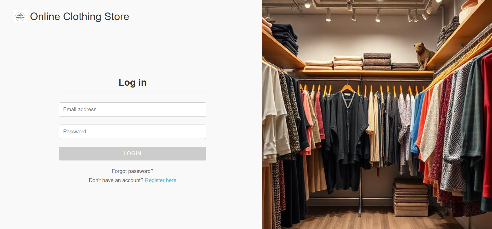
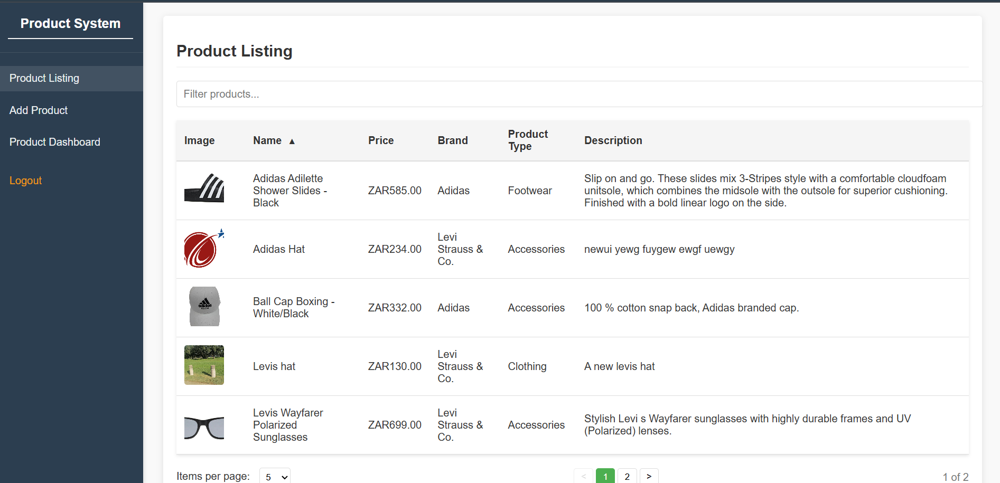
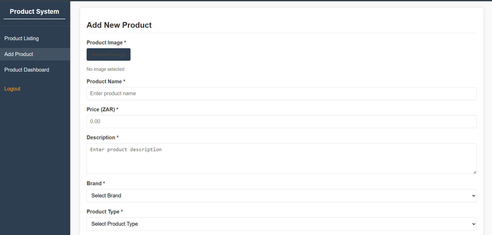
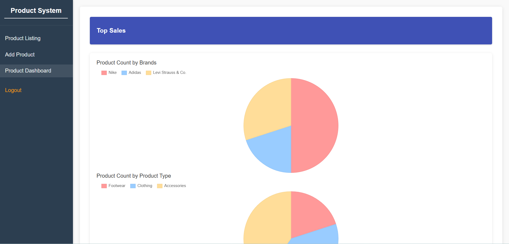

# Online Shop Application

## Screenshots

<p align="center">
  
  
  
  
</p>

---

## Project Overview

This project is an online shop web application that displays statistics on the most bought products using Chart.js, allows users to view and add new products, and provides a modern Angular frontend with a C# .NET backend API.

- **Frontend:** Angular (v19.2.10)
- **Backend:** .NET 8+ C# API
- **Database:** SQL Server (for product data import)

---

## Features

- User registration and login (registration required before login)
- Product listing and dashboard
- Add new products
- View stats on most bought products (Chart.js)

---

## Requirements

- .NET 8 or later (for backend)
- SQL Server (to run the `SqlDataCodeScript.sql` in the Data folder for importing product data)
- Node.js and npm (for frontend)
- Angular CLI v19.2.10 (`ng --version`)

---

## Setup Instructions

### Backend

1. **Recommended:** Open the backend project in Visual Studio for the best experience.
   - You may use another IDE/editor, but setup may be more tedious.
2. Ensure you have .NET 8 or later installed.
3. Make sure SQL Server is running and accessible.
4. Run the `SqlDataCodeScript.sql` file (located in the Data folder) in your SQL Server instance to import product data.
5. **Note:** Running the backend on Linux is not recommended due to potential support issues.

### Frontend

1. Navigate to the `frontend` folder:
   ```bash
   cd frontend
   ```
2. Install dependencies:
   ```bash
   npm install
   ```
3. Start the Angular app:
   ```bash
   ng serve
   ```

---

## Usage

- Register a new user account in the app.
- Login with your credentials.
- Browse products, view stats, and add new products as needed.

---

## Notes

- Passwords must be strong; otherwise, the app will throw an error.

---

## License

This project is for educational purposes.
